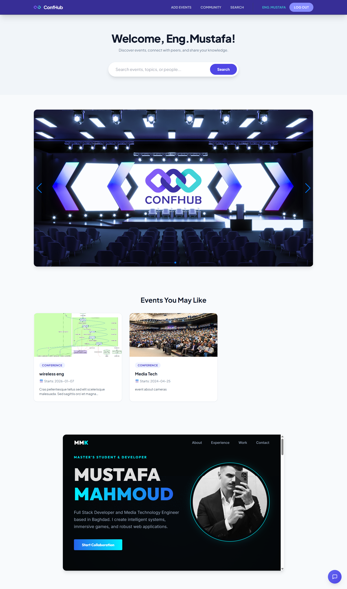

# ConfHub: AI-Powered Academic Conference Search & Community Hub

ConfHub is a comprehensive, full-stack web ecosystem designed to bridge the growing gap between academic event discovery and peer-to-peer developer engagement. In today's highly fragmented research landscape, academics, students, and tech professionals often struggle to find relevant conferences, calls for papers (CFPs), and symposiums scattered across thousands of disparate, static university and organizational websites. 

ConfHub solves this systemic issue by combining an intelligent, LLM-powered search microservice with a dynamic, Reddit-style social community platform. By unifying data aggregation with human interaction, ConfHub serves as a centralized, interactive nexus for continuous discovery, technical discussion, and professional networking.

> 

---

## Core System Architecture and Features

### 1. Intelligent Conference Search Engine
At the heart of ConfHub is a robust, federated search infrastructure that fundamentally changes how researchers hunt down event details, removing the friction of manual curation.

* **Federated Scraping & Aggregation:** Rather than relying on a single, limited, and often outdated database, ConfHub utilizes a federated approach. It aggregates real-time research metadata and upcoming event schedules simultaneously across multiple domains. By leveraging the OpenAlex Graph API for deep academic networking data, Semantic Scholar indexes for paper and author relevance, and public DuckDuckGo text parsers to catch brand-new, unindexed web updates, the platform ensures users receive the most comprehensive and up-to-date event data available globally.
* **AI Chatbot Assistant & NLP Inference:** Searching with rigid, Boolean keywords is a thing of the past. ConfHub integrates a dedicated Python Flask microservice that interfaces directly with the Hugging Face `Meta-Llama-3-8B-Instruct` large language model. This integration allows users to ask natural, highly contextual questions. For example, a user can query, "Find me upcoming cybersecurity workshops in Europe this fall that focus on zero-trust architectures," or "Summarize the submission formatting guidelines for this specific AI symposium." The LLM processes the aggregated scraped data and returns concise, conversational, and highly accurate summaries, saving hours of manual reading.
* **Smart Caching & Rate Limit Protection:** To guarantee lightning-fast response times and protect against third-party API rate-limiting or unexpected service outages, the search engine employs a sophisticated programmatic caching architecture. By utilizing JSON serialization mapped to unique MD5 request hashes, the system intercepts duplicate or highly similar queries and serves them instantly from local memory. This prevents network bottlenecking during heavy search loads, drastically reduces API consumption costs in a production environment, and ensures a seamless, uninterrupted user experience.

### 2. Reddit-Style Community Hub
Discovery is only the first half of the academic journey. ConfHub features a deeply integrated interactive social layer built to foster meaningful discussions around the events users discover, transforming solitary research into collaborative networking.

* **Interactive Post Composer:** Users can seamlessly publish updates, ask technical questions, and share multimedia posts to a global, chronological community feed. Whether a researcher is sharing a Call for Papers (CFP), a student is coordinating travel plans and accommodation sharing for a summit in Tokyo, or a keynote speaker is opening a pre-conference discussion thread, the composer supports rich, immediate engagement.
* **Dynamic Engagement Mechanics:** The platform utilizes asynchronous components to provide a fluid, app-like feel without constant page reloads. This includes single-click post likes to surface the most valuable content meritocratically, threaded comment sections, and nested peer-to-peer discussions. This structural design allows for deep, highly technical dives into specific methodologies without cluttering the main timeline view.
* **Secure User Profiles & Reputation Management:** Identity and reputation are critical currencies in academic and developer circles. ConfHub provides secure, customized user profiles where individuals can establish their professional presence. Users can display their historical event hosting record, track their community engagement analytics, and showcase their specific topics of interest through dynamic tagging algorithms (e.g., categorizing themselves under Bioinformatics, Machine Learning, or UI/UX Design).

### 3. Premium Unified Architecture
A powerful backend requires an equally sophisticated, highly maintainable frontend. ConfHub's user interface is built with architectural maintainability and modern aesthetics as its primary directives.

* **Centralized Layouts & The DRY Principle:** Adhering strictly to the DRY (Don't Repeat Yourself) principle of software engineering, the application uses a globally reusable navigation and layout wrapper (`navbar.php`). This component-based approach ensures absolute visual consistency across all endpoints. A single change to the branding, color scheme, or navigation structure only needs to be made in one master file to instantly propagate across the entire application, eliminating fragmented UI states.
* **Responsive, Utility-First Design:** Utilizing a clean, modern CSS architecture powered by Tailwind CSS paradigms, the platform is fully optimized for all viewport dimensions. Utilizing a mobile-first approach, the fluid flexbox grids, CSS grid layouts, and custom scalable vector graphics (SVG) iconography adapt flawlessly. Whether viewed on a 4K desktop workstation or a mobile phone while commuting, the application provides an immersive, native-feeling experience without horizontal scrolling or broken containers.

### 4. Self-Healing Database Infrastructure
ConfHub eliminates the traditional headaches of local environment setups, complex deployment pipelines, and manual database configuration for new contributing developers.

* **Automated Zero-Config Migrations:** The MySQL backend is designed to be entirely autonomous and self-healing. Upon initialization, the core PHP connection scripts automatically query the database engine to verify the existence and integrity of all required tables (users, posts, comments, events, likes). If a table or a specific column schema is missing due to a fresh installation or a recent version update, the application dynamically constructs and alters the schema on the fly. This "plug-and-play" architecture means developers never have to manually import `.sql` dumps or run separate migration scripts to get the application running locally.

---

## UI Showcase Gallery

**Community Feed & Discussions**
This view highlights the asynchronous post composer and the chronological feed where users can interact with media-rich event announcements and peer questions.
> **[ PLACEHOLDER: Add your post.php screenshot here ]**
> *Replace this line with:* ``

**User Profile & Analytics Panel**
This interface demonstrates the customized user dashboard, showcasing engagement metrics, active interest tags, and a historical grid of hosted conferences.
> **[ PLACEHOLDER: Add your profile.php screenshot here ]**
> *Replace this line with:* ``

**AI Search & Chatbot Interface**
This screenshot captures the LLaMa-3 powered chat interface responding to complex user queries with synthesized, accurate event data.
> **[ PLACEHOLDER: Add your chatbot search screenshot here ]**
> *Replace this line with:* ``

---

## Technology Stack Breakdown

The platform leverages a hybrid technology stack, strategically utilizing PHP's rapid server-side DOM templating alongside Python's unparalleled data aggregation and artificial intelligence ecosystem.

* **Front-End Presentation Layer:** Constructed with HTML5, CSS3 (Tailwind utility classes), and Vanilla JavaScript (ES6). This combination delivers fluid layouts and asynchronous DOM updates without the heavy payload and compilation overhead of monolithic JavaScript frameworks like React or Angular.
* **Core Application Controller:** Powered by PHP (>= 8.0). PHP acts as the primary web server orchestrator, handling global routing, secure session state management, form processing logic, and maintaining the direct relational database context securely away from the client-side.
* **AI Microservice Bridge:** Engineered with Python 3, utilizing the Flask micro-framework and the Requests library. This operates as a standalone internal API to execute multi-source asynchronous web scrapers and interface securely with the Hugging Face LLaMa-3 inference layer.
* **Persistence & Data Layer:** Built on MySQL / MariaDB. The database structure provides robust relational indexing, cascading foreign key constraints to ensure strict data integrity (e.g., deleting a user removes all associated posts and likes automatically), and houses the self-healing schema logic.

---

## Local Setup & Installation Guide

Follow these comprehensive steps to deploy the ConfHub environment on your local machine for active development, contribution, and testing.

### Prerequisites
1. **Web Server Stack:** A local server environment such as XAMPP, MAMP, or a custom configured LAMP/WAMP stack running Apache and MySQL.
2. **Python Environment:** Python 3.8 or higher installed globally and added to your system's PATH variables.
3. **API Access Credentials:** A registered Hugging Face account with a generated API Access Token (required to communicate with the LLaMa-3 inference model).

### Step 1: Web Server Initialization
1. Clone this repository using Git, or extract the downloaded source files directly into your local web server's public execution directory (for example, `C:/xampp/htdocs/confhub/` on Windows or `/var/www/html/confhub/` on Linux).
2. Open your database administration tool (such as phpMyAdmin, DBeaver, or a standard MySQL CLI client) and create a brand-new, entirely empty database named exactly `login_db`.
3. Start your Apache and MySQL services via your server control panel. 
4. Navigate to the local project URL (e.g., `http://localhost/confhub/`) in your preferred web browser. The application's self-healing PHP initialization scripts will automatically detect the empty database and build all necessary relational table structures instantly upon the first page load.

### Step 2: AI Microservice Configuration
To enable the smart search and chatbot functionalities, the Python backend must be configured and running parallel to the PHP server.

1. Open your command prompt or terminal application and navigate directly into the root project directory where `chatbot.py` is located.
2. Install the required Python dependencies to power the API endpoints, web scrapers, and AI routing:
   ```bash
   pip install flask flask-cors requests huggingface_hub duckduckgo_search python-dotenv
